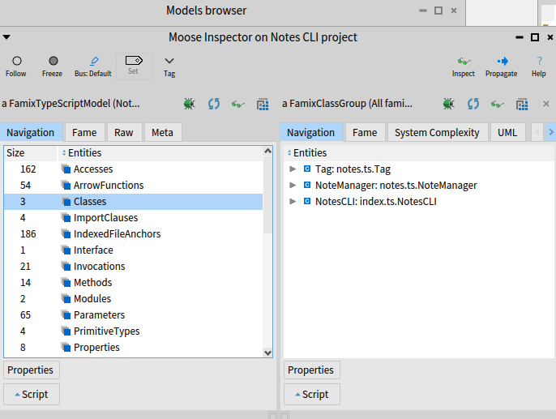
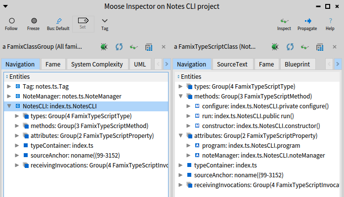
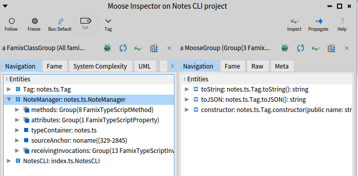

# MGL843-tp1

## Travail à réaliser

## 3.1.3 Règles importantes : Retour d'expérience IA

**Avez-vous déjà utilisé des outils d’IA générative pour programmer avant ce laboratoire ? Si oui, lesquels et dans quel contexte ?**

* **Raphael :** TODO
* **Pamela :** Oui, j'utilise Claude avec Zed pour mes projets perso. J'ai aussi essayé Warp pour le CLI, et Windsurf au travail pendant quelques jours (accès gratuit, mais vraiment pas terrible). D'habitude je donne des tâches précises - implémenter tel endpoint, refactorer telle fonction, et je review tout ce qu'il génère. J'ai l'impression que ces modèles deviennent moins performants avec le temps - j'ai lu que certains providers réduisent la quantization pour économiser des ressources.
* **Dorian :** Oui, utilisation quotidienne intégrée au flux de travail (via l'IDE Cursor). Utilisation pour la résolution de problèmes complexes et, lors de projets personnels, pour l'idéation d'architecture ou de pistes de développement (en utilisant des prompts de type "Agis comme un développeur Senior" pour éviter les mauvaises pratiques).

**Quelle a été votre expérience globale en utilisant l’IA générative pour créer ce projet TypeScript ? Quels aspects ont bien fonctionné et quels aspects ont été plus difficiles ?**

Notre expérience a été intuitive et très rapide grâce à l'agent **Gemini 3 Pro** intégré dans Visual Studio Code. Il nous a fallu seulement quelques prompts détaillant l'ensemble du TP1 pour générer le projet, les tests unitaires et le pipeline de test.

* **Points positifs :** L'agent a été bluffant par sa compréhension globale des requis et le respect des contraintes techniques. Il a réussi à implémenter toutes les fonctionnalités demandées.
* **Points négatifs/Difficultés :** L'IA a omis une bonne pratique essentielle : l'ajout d'un fichier `.gitignore` pour éviter de versionner des fichiers indésirables. De plus, elle a affirmé que le projet était terminé et fonctionnel alors que l'exécution des tests révélait encore un échec (hallucination sur le résultat des tests). Aussi le LLM a ajouté des dependences externe sans nous demander l'avis au préalable. 

**Combien de temps avez-vous pris pour créer ce projet TypeScript avec l’IA générative ? Avez-vous respecté le temps suggéré ?**

La création du projet et les légers ajustements nous ont pris environ **20 minutes**, ce qui nous positionne largement en dessous de l'estimation initiale de 45 à 60 minutes.

### 3.2 Partie 1 : Modélisation du projet TypeScript

> **Pourquoi appelle-t-on le modèle généré par ts2famix un « modèle de code source » ?**

Le modèle généré par `ts2famix` est qualifié de « modèle de code source » car il représente **les entités logicielles telles qu'elles sont implémentées** (fichiers, classes, méthodes, variables) ainsi que leurs relations statiques (héritage, invocations, accès).

Contrairement à un modèle de domaine ou conceptuel qui décrit des règles métier abstraites, le modèle Famix capture la structure exacte et détaillée du code (basé sur l'AST), ce qui le rend exploitable pour des tâches d'ingénierie logicielle comme l'analyse statique, la détection de métriques ou le refactoring.

> **Quelles sont les différences entre un modèle de code source Famix et un modèle de classes TypeScript en UML ? Peut-on tout modéliser de TypeScript dans les diagrammes de classes UML ? Soyez précis dans votre réponse.**

**Différences principales :**
* **Objectif :** Famix est un métamodèle destiné au traitement automatisé (parsing, analyse de données) qui capture des détails de bas niveau comme les invocations de méthodes ou les accès aux attributs à l'intérieur des fonctions. UML est un langage de modélisation visuel destiné principalement à la conception et à la communication entre humains, offrant souvent une vue plus abstraite.
* **Contenu :** Famix lie explicitement les éléments (ex: une méthode *x* appelle une méthode *y*). Un diagramme de classes UML standard se concentre sur la structure statique (héritage, composition) sans nécessairement capturer la dynamique des appels internes ou le flux de données.

**Limites de l'UML avec TypeScript :**
Non, il n'est pas possible de tout modéliser fidèlement de TypeScript dans un diagramme de classes UML standard sans adaptations lourdes. TypeScript possède des fonctionnalités spécifiques qui n'ont pas d'équivalent direct dans la norme UML (conçue initialement pour des langages orientés objets nominaux comme Java ou C++) :
1.  **Types avancés :** Les *Union Types* (`string | number`), *Intersection Types*, et *Utility Types* (`Partial<T>`, `Pick<T>`) sont difficiles à représenter.
2.  **Typage structurel :** TypeScript utilise le "duck typing" (compatibilité basée sur la forme de l'objet), alors qu'UML repose généralement sur une hiérarchie explicite (nominale).

### 3.3 Partie 2 : Visualisation du projet TypeScript

> **Quelles sont les classes remarquables dans le projet ? Comment le voyez-vous dans la visualisation ?**

Nous avons identifié une classe particulièrement remarquable : **`NoteManager`**. Celle-ci centralise la logique avec 8 méthodes.
Dans la visualisation générée par Roassal, elle apparaît **amplement plus grande** que les autres classes, ce qui souligne sa complexité et son poids dans le projet.


**Figure 0:** Inspection du modèle dans Moose - 3 classes identifiées (Tag, NoteManager, NotesCLI)


**Figure 1:** Visualisation des classes avec Roassal


**Figure 2:** Navigation vers la classe NotesCLI dans Moose


**Figure 3:** Navigation vers la classe NoteManager dans Moose

> **Expliquez le rôle de ces classes dans le projet. Pourquoi sont-elles importantes ?**

* **`NotesCLI`** : Gère les interactions avec l'utilisateur via la console (terminal), en s'appuyant sur la librairie externe `commander`. Elle sert de point d'entrée.
* **`Tag`** : Classe modèle simple représentant une étiquette via un attribut `name`.
* **`NoteManager`** : Agit comme un "pseudo-repository". Elle gère la persistance des données (lecture/écriture du fichier JSON) et la logique métier (ajout/modification de notes).

> **Commentez sur la qualité de la conception du projet. Y a-t-il des classes qui semblent mal conçues ? Pourquoi ?**

*Note de contexte : Notre projet a initialement été modélisé selon un paradigme fonctionnel, ce qui nous a bloqués pour la partie visualisation. Bien que le modèle ait été correctement généré par `ts2famix`, il s'est avéré inexploitable avec Roassal 3. Nous avons dû refaire une passe avec le LLM pour favoriser un paradigme orienté objet.*

Concernant la conception actuelle, la classe **`NoteManager`** présente un défaut d'optimisation.
Les interactions avec les données ne sont pas optimisées : chaque opération (ajout, tag, export, list) appelle la méthode `loadNotes`, provoquant une **lecture système du fichier JSON à chaque fois**.
**Amélioration suggérée :** Une approche avec un chargement unique (caching) en mémoire (instanciation d'un tableau) au démarrage de l'application aurait été plus adéquate pour réduire les accès disque et améliorer les performances.

### 3.4 Partie 3 : Exportation des données


#### Classe Pharo

**Nom de la classe:** `TypeScriptModelCSVExporter`
**Package:** `MGL843-TP1-Export`

```smalltalk
Object subclass: #TypeScriptModelCSVExporter
    instanceVariableNames: 'model outputPath'
    classVariableNames: ''
    package: 'MGL843-TP1-Export'.

TypeScriptModelCSVExporter >> exportToCSV
    | classes writeStream |
    classes := model allModelClasses.
    writeStream := outputPath asFileReference writeStream.
    [
        (NeoCSVWriter on: writeStream)
            nextPut: #('ClassName' 'NumberOfMethods' 'NumberOfAttributes');
            nextPutAll: (classes collect: [ :class |
                { class name. class methods size. class attributes size }
            ])
    ] ensure: [ writeStream close ].
    ^ 'CSV exported to ', outputPath.
```

#### Utilisation de NeoCSV

On utilise **NeoCSV** pour générer le CSV. Le principe est simple: on crée un `NeoCSVWriter` sur un stream, on écrit les en-têtes avec `nextPut:`, puis toutes les données avec `nextPutAll:`. Le bloc `ensure:` garantit que le fichier se ferme correctement même si quelque chose plante.

#### Synchronisation avec Iceberg

Le code a été pushé sur GitHub avec Iceberg. Ça a demandé quelques étapes de configuration (repair repository, créer les métadonnées, etc.) mais au final ça fonctionne. Voir les captures `fig5-iceberg-sync.png` et `fig5b-iceberg-history.png`.

#### Données exportées

Le fichier exporté est `notes-cli-classes.csv` (voir `fig4-csv-export.png`).

**Lien du dépôt GitHub:** https://github.com/raphaelNguimbus/MGL843-tp1

### 3.5 Partie 4 : Visualisation externe

On a utilisé **Python** avec Pandas et Matplotlib pour visualiser les données du CSV.

Le script `visualization/visualize_metrics.py` lit le fichier CSV et génère un graphique en barres groupées montrant le nombre de méthodes et d'attributs par classe. Voir `fig6-metrics-chart.png` pour le résultat.
