# MGL843-TP3 — Réusinage d’un projet TypeScript

### Amélioration de la CI/CD

Un point notable concerne la mise à jour de la pipeline d'intégration continue (CI). Nous avons intégré la génération automatique des métriques via tsfamix, ainsi que la création de schémas d'architecture pour chaque Pull Request (PR). Cette automatisation permet d'obtenir un feedback en temps réel sur l'impact des modifications apportées. Une branche dédiée est créée pour l'hébergement des images utilisées dans les commentaires des PRs, ces ressources sont systématiquement supprimées après la fusion (merge) de la PR pour maintenir le dépôt propre.


### 3.1 Identification des problèmes de conception

Les problèmes ci-dessous reprennent ce qu’on avait déjà observé au TP2, mais ici on les documente avec les métriques et les captures.

#### Rappel des métriques TP2

Les métriques suivantes ont été extraites du modèle FamixTypeScript via Moose et exportées en CSV.

| Classe | SLOC | Méthodes | WMC | CBO_in | CBO_out | RFC | TCC |
|---|---:|---:|---:|---:|---:|---:|---:|
| Tag | 14 | 3 | 1 | 13 | 0 | 3 | 0.0 |
| NoteManager | 158 | 11 | 17 | 18 | 65 | 11 | 0.436 |
| TagRepository | 132 | 12 | 20 | 16 | 19 | 12 | 0.045 |
| NotesCLI | 83 | 3 | 1 | 2 | 46 | 3 | 1.333 |


Dans les graphiques suivants, les couleurs indiquent le niveau de risque : **vert** = valeur saine, **jaune** = zone d'attention, **rouge** = zone de danger. Les lignes pointillées marquent les seuils. Pour le scatter plot, la **zone à risque** (en rouge pâle) correspond aux classes qui dépassent à la fois le seuil WMC (20) et CBO (14). La taille des points est proportionnelle au SLOC.

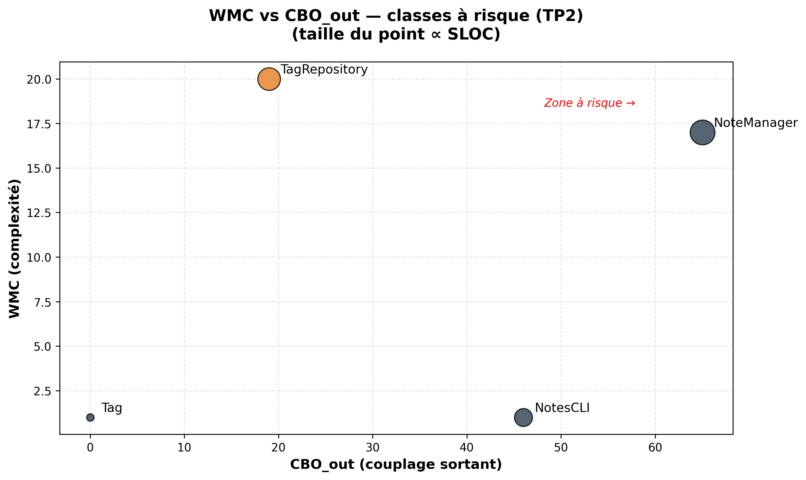

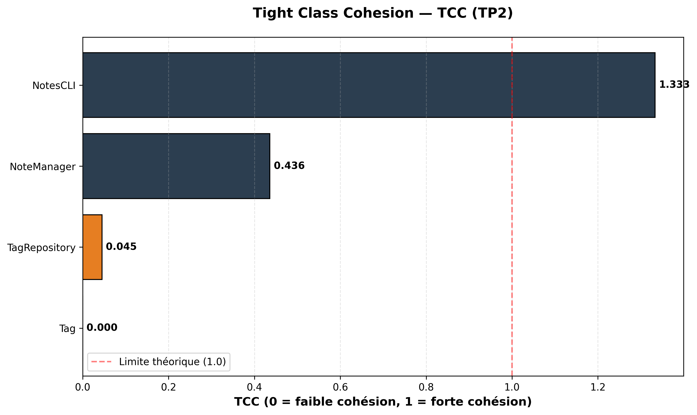


#### Problème 1 — NoteManager : classe trop centrale

`NoteManager` concentre plusieurs responsabilités : logique métier, persistance, expiration des notes et coordination avec `TagRepository`.

Les métriques vont dans le même sens :

- SLOC = 158 : c’est la plus grosse classe du projet ;
- WMC = 17 : la complexité cumulée est élevée ;
- CBO_out = 65 : le couplage sortant est très fort ;
- RFC = 11 : plusieurs appels sont déclenchés à partir d’une seule requête.

En pratique, on a clairement une violation du **SRP**. La cohésion n’est pas bonne non plus, parce que la même classe fait du métier, de la persistance et un peu de planification. On voit aussi un problème d’**Expert en information** : `loadNotes()` fait de la migration de tags alors que cette logique appartient davantage à `TagRepository`.

#### Problème 2 — TagRepository : cohésion très faible

`TagRepository` mélange plusieurs responsabilités dans la même classe :

- gestion des couleurs ;
- compteurs d’usage ;
- persistance ;
- CRUD des tags.

Les signaux les plus importants sont :

- TCC = 0.045 : cohésion très faible ;
- WMC = 20 : complexité élevée ;
- 12 méthodes qui touchent à des sujets assez différents.

Le point le plus gênant est `recalculateUsageCounts(notes: Note[])`, parce que cette méthode crée un couplage direct entre les tags et les notes. Pour nous, c’est contraire à **Faible couplage** et au **SRP**.

#### Problème 3 — server.ts : trop de choses au même endroit

Avant les réusinages du TP3, `server.ts` faisait environ 203 lignes et mélangeait :

- la configuration Express ;
- les routes API ;
- la validation des requêtes ;
- l’appel à la logique métier ;
- la planification avec `setInterval`.

Le fichier avait donc plusieurs raisons de changer. Ce n’est pas bon pour SRP, et ce n’est pas vraiment aligné avec **Contrôleur** et **Indirection** de GRASP.

#### Problème 4 — NotesCLI : complexité sous-estimée

`NotesCLI` donne l’impression d’être simple si on regarde juste les métriques, mais ce n’est pas toute l’histoire :

- WMC = 1 : valeur trompeuse ;
- TCC = 1.333 : valeur impossible en théorie ;
- 83 SLOC principalement dans `configure`.

> **Note — limite de ts2famix avec TypeScript :** TCC est mathématiquement borné entre 0 et 1. Une valeur de 1.333 indique un artefact de l’outil. ts2famix utilise l’API du compilateur TypeScript pour construire le modèle Famix, mais il ne reconnaît pas toujours les fonctions fléchées (`() => {}`) comme des méthodes de classe — il peut les traiter comme des propriétés ou des fonctions autonomes. Quand une fonction fléchée capture `this`, ts2famix peut générer des associations `FAMIXAccess` en double, ce qui fait gonfler le numérateur de TCC au-delà du dénominateur. Le WMC peut aussi être sous-estimé si certaines méthodes définies via des fonctions fléchées ne sont pas comptées. Ce comportement est une limitation connue de ts2famix pour les classes TypeScript qui utilisent des fonctions fléchées imbriquées. Les valeurs TCC anormales dans ce projet sont donc à lire comme des artefacts de l’outil, pas comme des mesures réelles de cohésion.

#### Problème 5 — planification de l’expiration couplée au serveur

Le mécanisme d’expiration est directement dans `server.ts` :

```typescript
setInterval(() => {
    const deletedCount = noteManager.deleteExpiredNotes();
    if (deletedCount > 0) {
        console.log(`Deleted ${deletedCount} expired note(s)`);
    }
}, 5 * 1000);
```

Ça ajoute une responsabilité de plus au point d’entrée du serveur. Si la stratégie change plus tard, il faut modifier `server.ts`, ce qui n’est pas idéal. On perd en **Protection des variations**, en **Indirection** et encore une fois en **SRP**.

#### Synthèse

| Classe/Fichier | Problème principal | Heuristiques touchées | Indice principal |
|---|---|---|---|
| NoteManager | Large Class / responsabilités mélangées | SRP, Forte cohésion, Expert en information | WMC=17, CBO_out=65, SLOC=158 |
| TagRepository | Faible cohésion | SRP, Forte cohésion, Faible couplage | TCC=0.045, WMC=20 |
| server.ts | Responsabilités mélangées | SRP, Contrôleur, Indirection | 203 SLOC |
| NotesCLI | Long Method masquée | SRP | 83 SLOC, WMC peu fiable |
| Expiration dans server.ts | Couplage inutile | SRP, Protection des variations, Indirection | `setInterval` inline |

---

### 3.2 Proposition d'améliorations

À partir des problèmes de la section 3.1, on a retenu trois réusinages réalisés et une recommandation gardée de côté.

#### Réusinage #1 — Restructuration architecturale

Ce réusinage regroupe trois changements liés entre eux. Consultable à vers la Pull Request ici : PR [#7](https://github.com/raphaelNguimbus/MGL843-tp1/pull/7)

Actions entreprises :
- Conformément au principe de responsabilité unique (SRP - Single Responsibility Principle), nous avons entrepris un réusinage visant à découpler ces responsabilités dans des fichiers distincts.

##### 1a. Décomposer `server.ts` en couches

Le premier réusinage correspond surtout à un ménage de structure. `server.ts` concentrait trop de choses, donc on l'a découpé pour sortir les routes, les contrôleurs et la configuration du serveur. Après ça, le fichier redevient surtout un point d'entrée. Dit simplement, on a essayé d'arrêter de faire porter au même endroit la configuration HTTP, les décisions de routage et la coordination métier. 
Après le changement, `server.ts` passe de **203 à 40 lignes** (réduction de 80%). Les routes et les contrôleurs sont déplacés dans leurs propres fichiers (`routes/note.ts` 20 lignes, `routes/tag.ts` 17 lignes, `controllers/note.ts` 104 lignes, `controllers/tag.ts` 77 lignes). Ce changement applique surtout : Contrôleur (GRASP) ; SRP ; Faible couplage.

##### 1b. Introduire un `NoteRepository`

Dans la même logique, on a séparé la persistance de `NoteManager` avec un `NoteRepository`. L'idée n'était pas de rajouter une couche "par principe", mais plutôt d'éviter que `NoteManager` connaisse encore les détails de lecture et d'écriture. On a donc introduit l'interface suivante :

```typescript
export interface NoteRepository {
    loadAll(): Note[];
    saveAll(notes: Note[]): void;
    exportTo(filePath: string): void;
}
```

Puis une implémentation concrète `FileNoteRepository`, injectée dans `NoteManager`.
Le gain attendu était simple : `NoteManager` dépend d’une abstraction et n’a plus besoin de connaître les détails de lecture/écriture de fichiers. Ça va dans le sens d' Indirection, du DIP et de la Protection des variations.

##### 1c. Séparer le module monolithique `notes.ts`

Le fichier `src/notes.ts` (378 lignes) regroupait trop d’éléments dans un seul module : `Tag`, `TagRepository`, `Note` et `NoteManager`. On l’a éclaté en : `src/tag.ts` (163 lignes), `src/manager/NoteManager.ts` (213 lignes), `src/repository/noteRepository.ts` (40 lignes).
Ce changement va dans le sens de : SRP; Forte cohésion; une structure plus claire du projet.
Ce n'est pas le changement le plus "spectaculaire", mais en pratique c'est celui qui rend le projet plus lisible quand on navigue dedans.

Voici un aperçut des métriques:


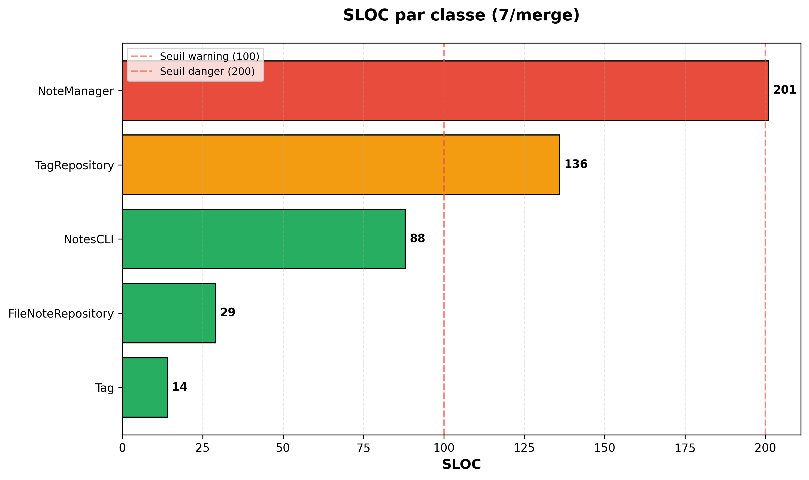


#### Réusinage #2 — Intégration de TagService (assistance IA)

Ce réusinage introduit une couche service dédiée aux tags. Nous avons  sollicité l'agent Codex à travers l'IDE Cursor pour identifier des pistes d'amélioration à la Pull Request suivante : PR [#8](https://github.com/raphaelNguimbus/MGL843-tp1/pull/8).

Analyse des modifications apportées :
- Encapsulation réussie : L'agent a encapsulé la classe Repository au sein d'une classe Service. Cette modification est pertinente car elle réduit le couplage entre la logique métier et la couche de persistance.

- Limites de l'intervention : Bien que le couplage ait été amélioré, l'agent n'a pas procédé à la décomposition des différentes responsabilités de la classe NoteManager.

- Constat : En l'absence d'une véritable séparation des préoccupations, la classe NoteManager conserve son statut de "God Class" (ou fichier monolithique), centralisant encore trop de fonctions disparates.

`TagRepository` mélange persistance et logique métier dans la même classe. On l’a éclaté en deux :

- `TagService` : absorbe toute la logique métier (CRUD, validation, recherche)
- `FileTagRepository` : gère uniquement la lecture/écriture sur disque

`NoteManager` délègue maintenant via le service :

```typescript
// Avant — accès direct au repository
this.tagRepository.addTag(name, color);

// Après — délégation au service
this.tagService.createTag(name, color);
```

Les heuristiques visées : **Expert en information** (la logique métier des tags est dans le service), **Indirection** (NoteManager n’accède plus directement à la persistance), **SRP** (séparation claire entre les deux responsabilités).

Impact sur les métriques après ce réusinage :

| Classe | SLOC | WMC | CBO_out | TCC | Changement principal |
|---|---:|---:|---:|---:|---|
| NoteManager | 201 → 197 | 20 → 19 | 48 → 46 | .64 → .62 | Délègue aux services |
| TagRepo → TagService | 136 → 116 | 20 → 16 | **7 → 21** | .05 → .00 | Absorbe la logique métier |
| FileTagRepository | nouvelle | 3 | 1 | 1.00 | Persistance isolée |

Le CBO_out de TagService augmente parce qu’il centralise des responsabilités qui étaient éparpillées. C’est un compromis attendu lors d’une centralisation de logique.

Voici un aperçut des métriques:

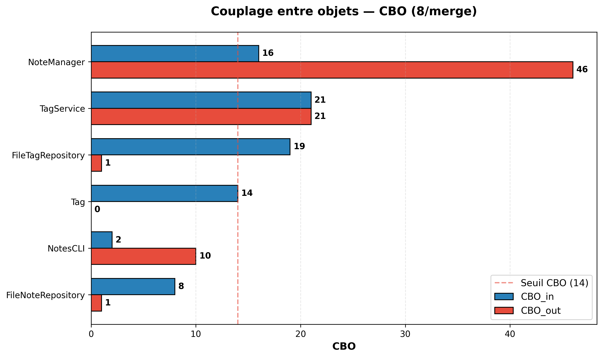
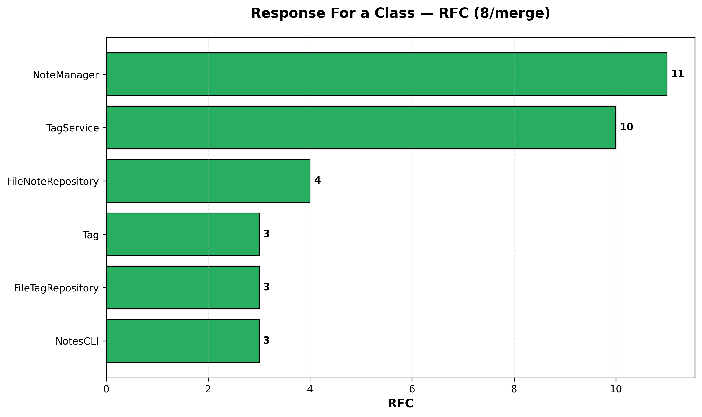
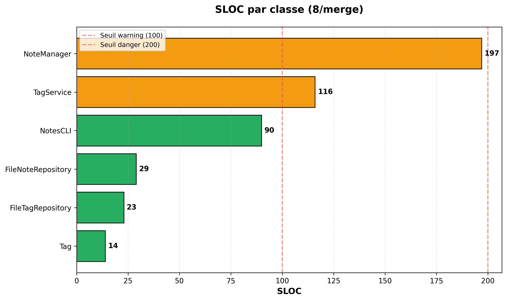
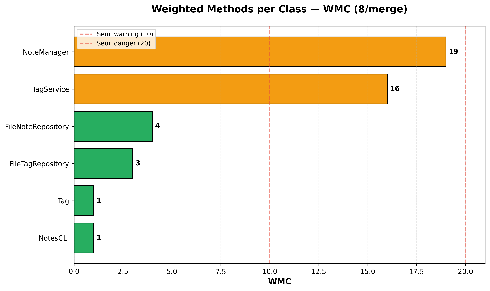

#### Réusinage #3 — Refactorisation de NotesCLI

Cette [Pull Request](https://github.com/raphaelNguimbus/MGL843-tp1/pull/14) refactorise l'interface en ligne de commande (`NotesCLI`) pour corriger l'explosion de ses métriques RFC (Response For a Class) et CBO_out (Couplage sortant).

Avant cette modification, `NotesCLI` agissait comme un composant monolithique gérant toute la configuration et l'implémentation logique du chaînage des commandes commander.

**Changements effectués**
- **Création de l'interface `ICLICommand`** : Standardisation du contrat d'exécution pour chaque déclaration de commande.
- **Extraction des commandes** : L'énorme bloc `.action()` de 80 lignes a été divisé en 5 classes indépendantes, cohésives, et dédiées chacune à une responsabilité unique :
  - `CreateNoteCommand`
  - `ListNotesCommand`
  - `TagNoteCommand`
  - `SearchNotesCommand`
  - `ExportNotesCommand`
- **Nettoyage de `NotesCLI`** : Le coordinateur a été réduit à un simple registre de tableau qui itère pacifiquement sans avoir connaissance de la logique interne des commandes.

Voici un aperçu des métriques suite à cette refactorisation :


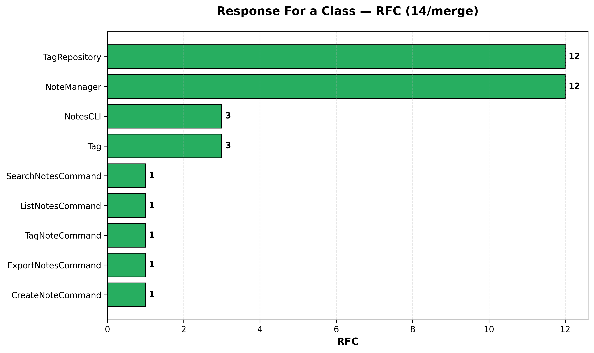

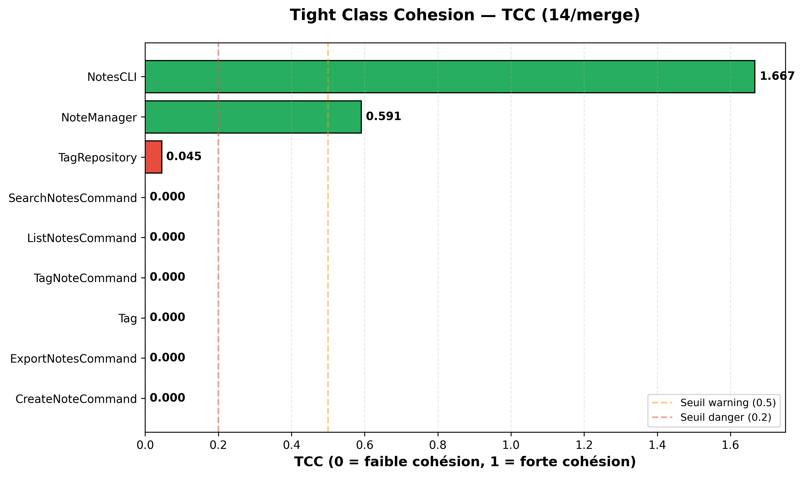
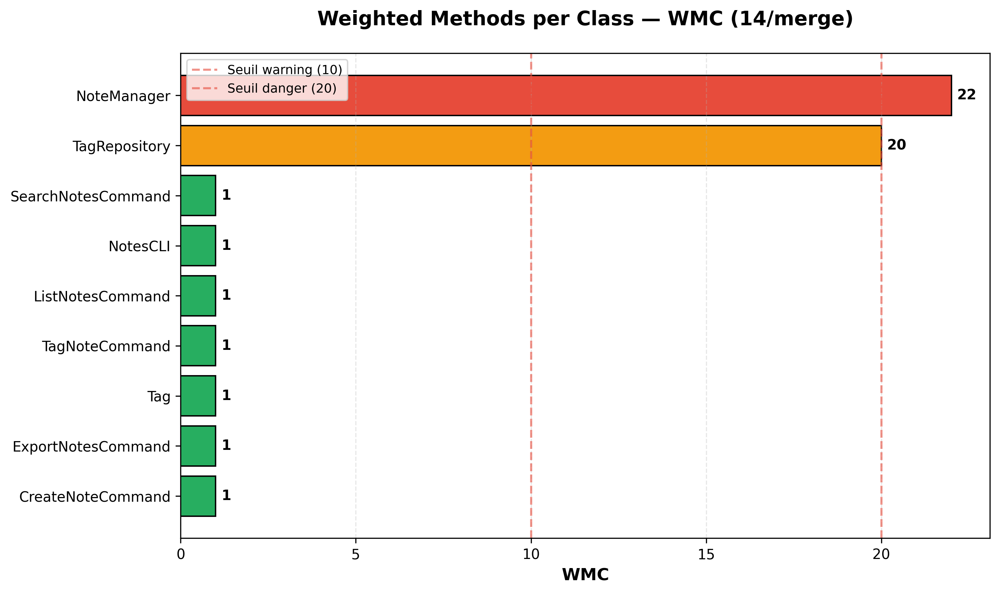

#### Réusinage #4 — Cohésion de TagService

Ce [réusinage](https://github.com/raphaelNguimbus/MGL843-tp1/pull/11) cible la cohésion interne de `TagService` et réduit le couplage de `NoteManager` avec les entités de tag.

Les changements :

- **Extraction de `TagColorService`** — la logique de gestion des couleurs est déplacée dans une classe dédiée. `TagService` ne gère plus les couleurs par défaut.
- **Ajout de `resolveTag()`** — corrige le Feature Envy dans `loadNotes()`. Dans le TP2, `NoteManager` gérait lui-même la résolution de tags bruts (string ou objet). Cette logique appartient à `TagService`.
- **Ajout de `assignTag()`** — dans `addNote()` et `updateNote()`, NoteManager appelait `createOrGetTag()` + `incrementUsage()` + `new Tag(...)` pour chaque tag. `assignTag()` regroupe ces trois appels en un seul, et NoteManager n’a plus besoin d’importer `Tag` directement.
- **Suppression de `recalculateUsageCounts()`** — cette méthode existait déjà dans `TagRepository` au TP2 (identifiée comme problème section 3.1). L’IA l’a conservée dans `TagService` au réusinage #2 comme filet de sécurité défensif. On l’a supprimée au réusinage #3 : les compteurs d’usage sont déjà maintenus en temps réel via `incrementUsage()` / `decrementUsage()` à chaque opération, la méthode était donc redondante et créait un couplage inutile entre les tags et les notes. L’appel au démarrage dans `server.ts` a aussi été retiré.
- **Déplacement de la règle métier de suppression** — la vérification `usageCount > 0` était dans le contrôleur. Elle appartient à `TagService` : c’est une règle sur les tags, pas une décision HTTP. `TagService.deleteTag()` lève maintenant une erreur si le tag est encore utilisé, et le contrôleur se contente de la catcher (400 au lieu de 500).

**Avant** — `loadNotes()` dans NoteManager résolvait les tags inline :

```typescript
// NoteManager.loadNotes() — 14 lignes de logique sur les tags
tags: (note.tags || []).map((t) => {
    if (typeof t === ‘string’) { /* lookup + new Tag(...) */ }
    else if (t.name) { /* lookup + new Tag(...) */ }
    return new Tag(‘unknown’, ‘#8b5cf6’);  // couleur hardcodée
})
```

**Après** — la résolution est déléguée à `TagService.resolveTag()` :

```typescript
// NoteManager.loadNotes() — une seule ligne
tags: (note.tags || []).map((t) => this.tagService.resolveTag(t))

// TagService.resolveTag() — gère les formats string/objet/inconnu
resolveTag(raw) → vérifie le type, getTagByName(), retourne un Tag
```

La logique de résolution est maintenant dans `TagService` (Expert en information), et `loadNotes()` se contente de déléguer.

Impact sur les métriques :

| Classe | SLOC | WMC | CBO_out | TCC | Changement principal |
|---|---:|---:|---:|---:|---|
| NoteManager | 197 → 178 | 19 → 19 | **46 → 34** | .62 → .49 | Import Tag supprimé |
| TagService | 116 → 105 | 16 → 20 | 21 → 23 | .00 → .02 | resolveTag + assignTag |
| TagColorService | nouvelle | 1 | 0 | .00 | Couleurs extraites (SRP) |

Le WMC de TagService monte parce qu’on ajoute des méthodes. Le CBO_out de NoteManager baisse de 12 points parce qu’il n’importe plus directement `Tag`.

Les heuristiques visées : **Expert en information** (TagService sait tout sur les tags), **Forte cohésion** (chaque classe a un rôle clair), **Faible couplage** (NoteManager ne dépend plus de Tag directement).

> **En pratique :** on a déplacé la logique au bon endroit, mais `resolveTag()` ne nous satisfait pas complètement côté code. Le `any` dans la signature annule toute la sécurité de type, et la logique reste assez tassée. Ça marche, mais c’est un rappel que les métriques disent où placer les responsabilités, pas si le code est vraiment propre une fois écrit.

#### Recommandation non réalisée — Extraire `ExpirationScheduler`

On avait aussi envisagé d'extraire une classe `ExpirationScheduler` pour isoler la logique de planification. Sur le papier, l'idée reste défendable, surtout pour rendre l'architecture plus lisible. Mais dans le cadre du TP, on ne l'a pas retenue.

L'assistant IA a rejeté cette recommandation avec un argument métrique : la logique ne représente que 5 lignes, le WMC de `NoteManager` ne baisserait que d'un point (17→16), et le CBO du système augmenterait avec une nouvelle classe. D'après Isong & Obeten (2013), c'est justement le CBO qui est le meilleur prédicteur de fautes — donc augmenter le couplage pour une petite entorse au SRP ne serait pas un bon échange. L'IA a aussi signalé le risque de produire une **Lazy Class** au sens de Fowler.

En tant que développeurs, on n'est pas entièrement d'accord. Une classe `ExpirationScheduler` rend l'intention architecturale plus claire pour quelqu'un qui découvre le projet — c'est le genre de chose que les métriques ne capturent pas, mais qu'on voit tout de suite quand on navigue dans le code. On aurait préféré le faire, mais dans le cadre du TP on a priorisé les réusinages avec le plus d'impact mesurable. On garde l'idée comme piste d'évolution, surtout si la logique d'expiration venait à se complexifier.

#### Synthèse des réusinages proposés

| # | Réusinage | Statut | Heuristiques principales |
|---|---|---|---|
| #1a | Décomposition de `server.ts` en couches | Fait | Contrôleur, SRP, Faible couplage |
| #1b | Introduction du patron Repository | Fait | Indirection, DIP, Protection des variations |
| #1c | Séparation du module `notes.ts` | Fait | SRP, Forte cohésion |
| #2 | Intégration de TagService (LLM) | Fait | Expert en information, Indirection, SRP |
| #3 | Cohésion de TagService + correction Feature Envy | Fait | Forte cohésion, SRP, Faible couplage, Expert en information |
| — | Extraire `ExpirationScheduler` | Non réalisé | SRP, Protection des variations |

Voici un aperçu des métriques suite à cette refactorisation :

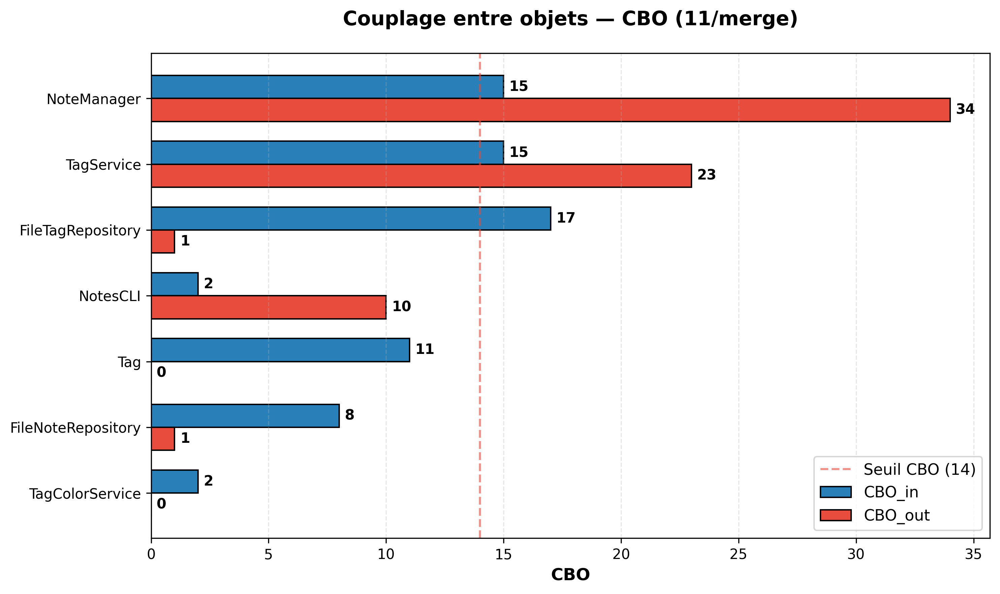
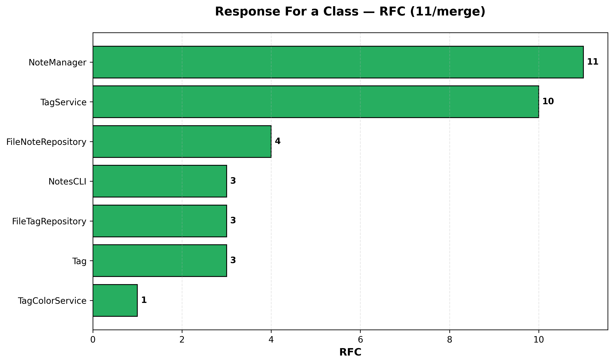
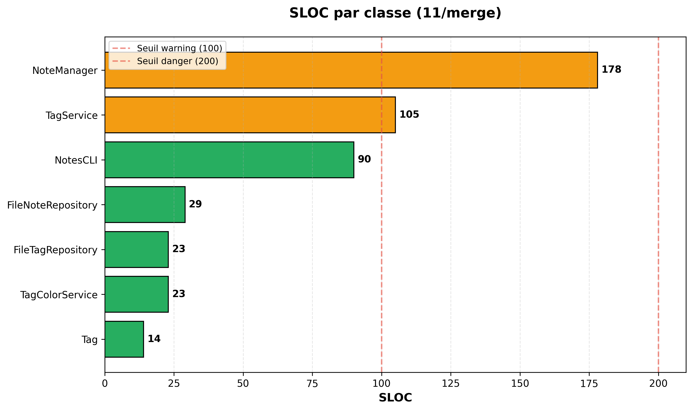
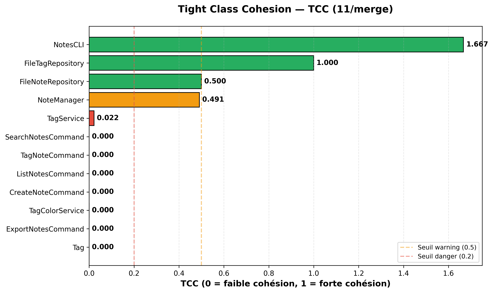
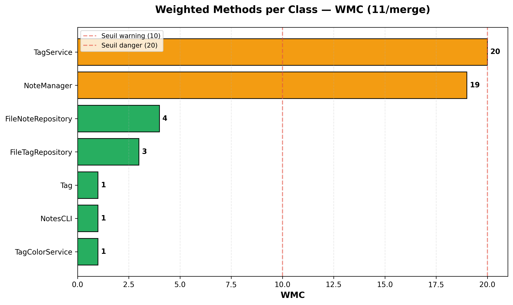
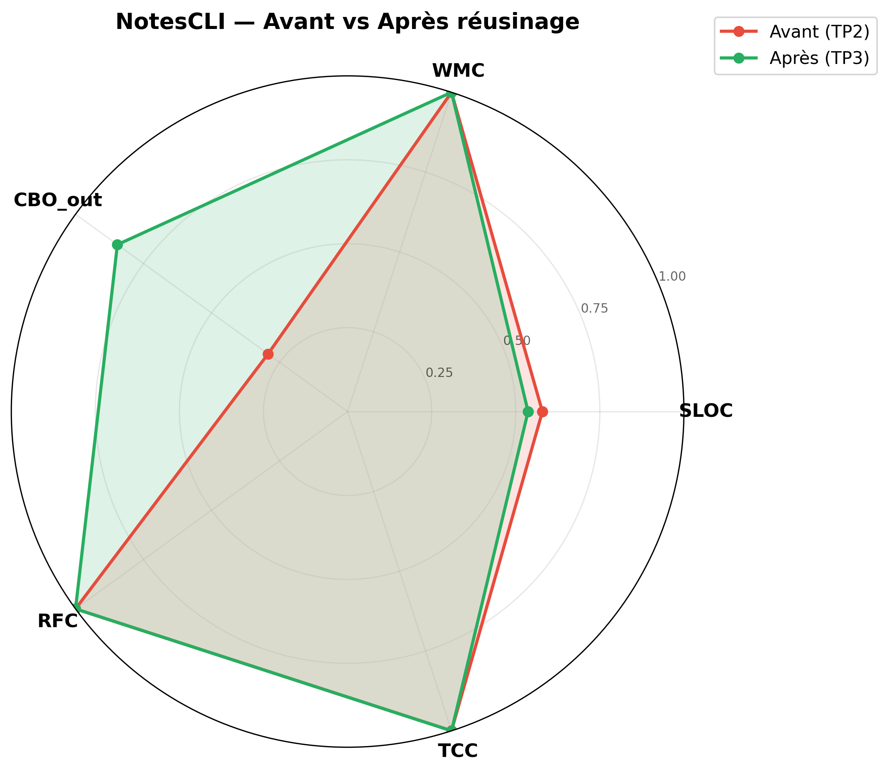
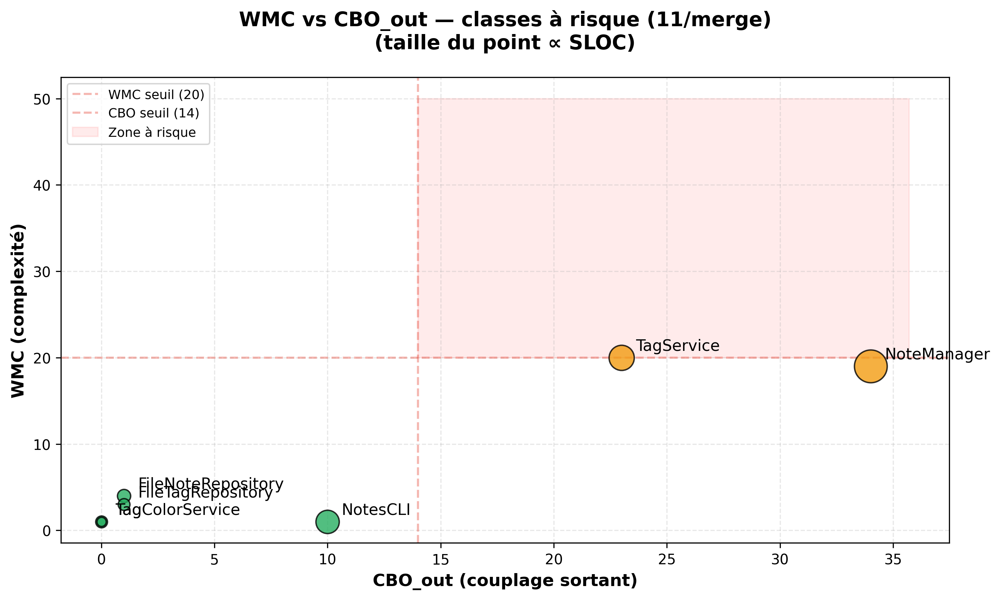

### 3.3 Réalisation et vérification des améliorations

#### Amélioration manuelle

Les changements ont été réalisés via Pull Requests avec CI qui passe à chaque étape.

- **Réusinage #1** — restructuration architecturale complète (Dorian)
- **Réusinage #2** — intégration de TagService, code généré par assistant IA (Dorian)
- **Réusinage #3** — cohésion de TagService + correction du Feature Envy (Pamela)
- **Pipeline métriques CK** — mise à jour du script Pharo pour exporter toutes les métriques nécessaires

#### Amélioration avec assistant IA

Les problèmes de la section 3.1 ont aussi été soumis à un assistant IA (Claude) pour comparer ses propositions avec les nôtres.

Trois branches ont été construites à partir de ces suggestions :
- **Réusinage #1 (Dorian)** : restructuration architecturale manuelle
- **Réusinage #2 (IA)** : intégration TagService — code généré par l'IA à partir des problèmes identifiés
- **Réusinage #3 (Pamela)** : cohésion de TagService

#### Comparaison des recommandations

| # | Recommandation | Équipe | IA | Commentaire |
|---|---|---|---|---|
| 1 | Extraire la persistance de `NoteManager` | ✅ | ✅ | Même direction |
| 2 | Décomposer `server.ts` | ✅ | ✅ | Même direction |
| 3 | Séparer le fichier `notes.ts` | ❌ | ✅ | Proposition de l’IA uniquement |
| 4 | Extraire `TagColorService` | ✅ | ✅ | Même direction |
| 5 | Supprimer `recalculateUsageCounts()` | ✅ | ❌ | Existait au TP2, conservée par l’IA au R#2, supprimée par l’équipe au R#3 — logique dupliquée |
| 6 | Ajouter `resolveTag()` | ❌ | ✅ | Non identifié au TP2, proposé par l’IA |
| 7 | Extraire `ExpirationScheduler` | ✅ | ❌ | Désaccord — l’IA a rejeté (Lazy Class) |

#### Analyse du désaccord sur `ExpirationScheduler`

C’est le principal point où notre jugement de développeurs diverge de celui de l’IA.

L’IA a rejeté l’extraction parce que le gain métrique semblait trop faible : peu de lignes, baisse limitée du WMC, et risque de créer une classe trop mince. C’est compréhensible.

De notre côté, on aurait quand même gardé cette extraction comme bonne direction architecturale. Même si les métriques ne bougent presque pas, une classe `ExpirationScheduler` rendrait l’intention plus claire pour quelqu’un qui découvre le projet. Donc ici, la différence vient surtout du fait que l’IA raisonne beaucoup par les métriques, alors qu’en développement on regarde aussi la lisibilité de l’architecture.

#### Régénération du modèle et des métriques

Après les réusinages, le modèle FamixTypeScript et les métriques ont été régénérés automatiquement dans le pipeline CI/CD.

- Workflow : `.github/workflows/analyse-ts-with-moose.yml`
- Script Pharo : `.github/pharo-metrics-export.st`
- Artefacts : `export_metrics.csv`, `model.json`

#### Questions

##### 1) Quels sont les changements dans les métriques après les changements réalisés ?

Les figures suivantes montrent l’état après réusinage :

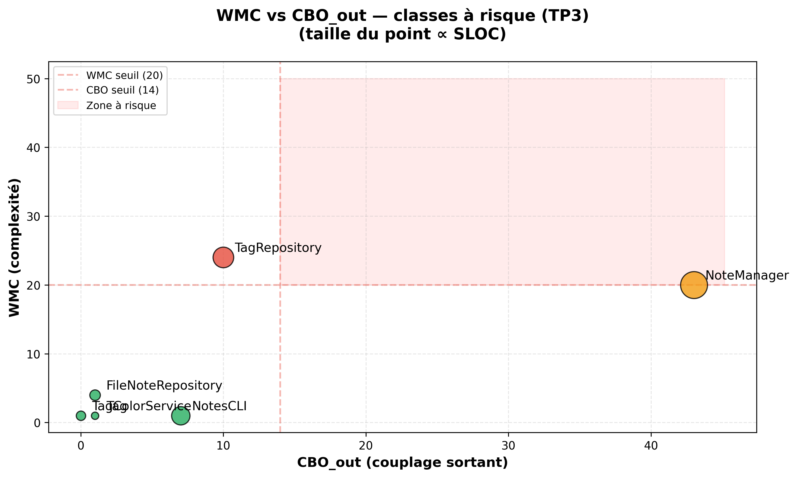

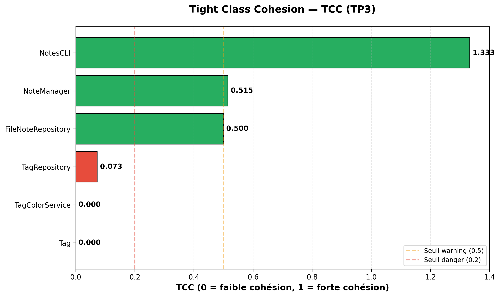

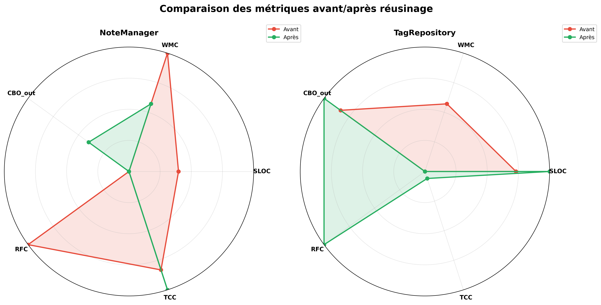

> **Comment lire ces graphiques radar :**
>
> Sur tous les axes, **un polygone plus grand = meilleur état**. Pour les métriques où une valeur basse est souhaitable (CBO_out, WMC, SLOC, RFC), les valeurs sont inversées dans le script — donc une baisse de CBO en pratique apparaît comme une extension vers l'extérieur sur le radar. Par exemple, NoteManager passe de CBO_out 65 à 34, et le polygone vert ("après") s'étend plus loin sur cet axe. Pour TCC, la valeur est affichée telle quelle (plus haut = meilleur).
>
> **Comment le score 0–1 est calculé :** le script utilise une **normalisation min-max relative** à chaque run de comparaison. Pour chaque métrique, il prend le minimum et le maximum observés dans l'ensemble des données (avant + après, toutes les classes comparées), puis applique : `score = (valeur - min) / (max - min)`. Le score **1.0 ne représente pas une valeur absolue idéale** — il signifie simplement "meilleure valeur observée dans cette comparaison". Si on ajoute une classe avec un CBO encore plus bas, l'échelle change et tout se recalibre.
>
> **Est-ce la méthode standard ?** La normalisation min-max est courante pour les radars de métriques logicielles (dont le papier référencé dans le script, Scientific Reports 2023). Une alternative plus rigoureuse serait d'utiliser des **seuils absolus** connus (ex. CBO > 14 = zone à risque, TCC < 0.2 = faible cohésion) — ce qui donnerait un 1.0 avec une signification fixe indépendante du dataset. La normalisation relative est plus simple à implémenter mais moins interprétable d'une run à l'autre.
>
> **Limite avec NotesCLI :** la valeur TCC = 1.333 (artefact ts2famix) devient le maximum du dataset et écrase l'échelle TCC pour toutes les autres classes — leurs variations TCC apparaissent donc visuellement minimes sur le radar même quand elles sont réelles.

Le point principal est que `NoteManager` et `TagRepository` ont réduit leur couplage sortant. `TagRepository` sort clairement d’une zone plus risquée sur l’axe du couplage. Les nouvelles classes créées restent petites et simples.

| Classe | Métrique | TP2 | Après R#1 | Après R#2 | Après R#3 |
|---|---|---:|---:|---:|---:|
| NoteManager | SLOC | 158 | 201 | 197 | **178** |
| NoteManager | WMC | 17 | 20 | 19 | 19 |
| NoteManager | CBO_out | 65 | **48** | 46 | **34** |
| NoteManager | TCC | 0.436 | 0.636 | 0.618 | 0.491 |
| TagRepo → TagService | SLOC | 132 | 136 | 116 | **105** |
| TagRepo → TagService | WMC | 20 | 20 | 16 | 20 |
| TagRepo → TagService | CBO_out | 19 | **7** | 21 | 23 |
| TagRepo → TagService | TCC | 0.045 | 0.045 | 0.000 | 0.022 |
| FileNoteRepository | SLOC | — | **29** (nouvelle) | 29 | 29 |
| FileTagRepository | SLOC | — | — | **23** (nouvelle) | 23 |
| TagColorService | SLOC | — | — | — | **23** (nouvelle) |

Les hausses de WMC sont à surveiller, mais elles ne racontent pas toute l’histoire :

- **TagService (16 → 20 au R#3)** : `resolveTag()` et `assignTag()` ajoutent délibérément des branchements — c’est la logique qu’on déplace depuis NoteManager.
- **NoteManager (17 → 20 au R#1)** : en partie un artefact lié à la réorganisation des fichiers et à la façon dont `ts2famix` compte la complexité après la séparation de modules.

##### 2) Les changements ont-ils amélioré la qualité du projet de manière mesurable ? Pourquoi ?

Oui, globalement oui.

Le meilleur signal est la baisse du CBO_out sur les 3 réusinages :
- `NoteManager` : `65 → 34` (réduction de 48%)
- `TagRepository` : `19 → 7` dès le R#1, puis réorganisé en TagService

C’est important parce que le couplage sortant est un vrai facteur de fragilité. Après les changements, les dépendances sont mieux réparties et moins directes.

La cohésion de NoteManager s’améliore aussi avec le R#1 (0.436 → 0.636), même si elle redescend légèrement après le R#3 (0.491) à cause de la réorganisation interne. TagService part de 0.0 après le R#2 et monte à 0.022 après le R#3 — c’est encore faible, mais la tendance est bonne.

Pour `SLOC`, on voit surtout une redistribution : NoteManager passe de 158 à 178, mais une partie du code a migré vers `FileNoteRepository`, `FileTagRepository` et `TagColorService` — trois classes simples et ciblées. L’organisation est meilleure et plus facile à maintenir.

##### 3) Comment les améliorations de l’assistant IA se comparent-elles à vos propres changements ? Ont-elles été plus faciles ? Pourquoi ou pourquoi pas ?

L’assistant IA a suivi une bonne partie de notre direction, mais avec des propositions plus précises. Sur la persistance, la séparation en couches et l’extraction de `TagColorService`, on est arrivés à peu près au même résultat.

L’IA a aussi vu deux choses qu’on n’avait pas explicitement formulées dans le TP2 : le problème du gros fichier `notes.ts` et le Feature Envy dans `loadNotes()`. Sur ces points, son apport a été utile.

Un cas intéressant : `recalculateUsageCounts()` existait déjà dans `TagRepository` au TP2 et avait été identifiée comme problème. L’IA l’a conservée dans `TagService` au réusinage #2 comme filet de sécurité. En pratique, c’était de la logique dupliquée — les compteurs étaient déjà à jour en temps réel. On l’a supprimée au réusinage #3. C’est un exemple où le code généré par l’IA fonctionnait, mais n’était pas optimal — il faut toujours relire et valider.

Par contre, elle a rejeté `ExpirationScheduler`, alors que nous on considère encore que ce serait un bon choix pour la lisibilité architecturale. Donc l’IA aide bien pour repérer et structurer les idées, mais il faut garder une validation humaine. Elle optimise vite par les métriques, mais pas toujours selon les mêmes critères qu’une équipe de dev.

L’approche IA a été plus rapide pour générer un plan de réusinage. Mais au final, il faut quand même relire, filtrer et décider. Plus rapide, oui. Plus autonome, pas vraiment.
