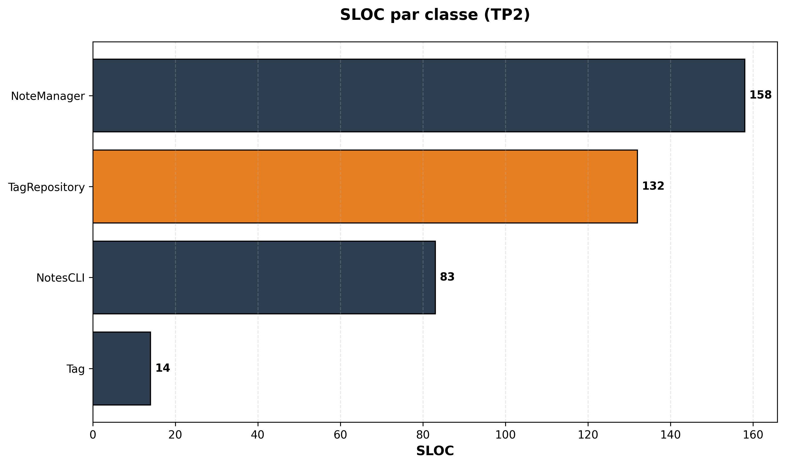
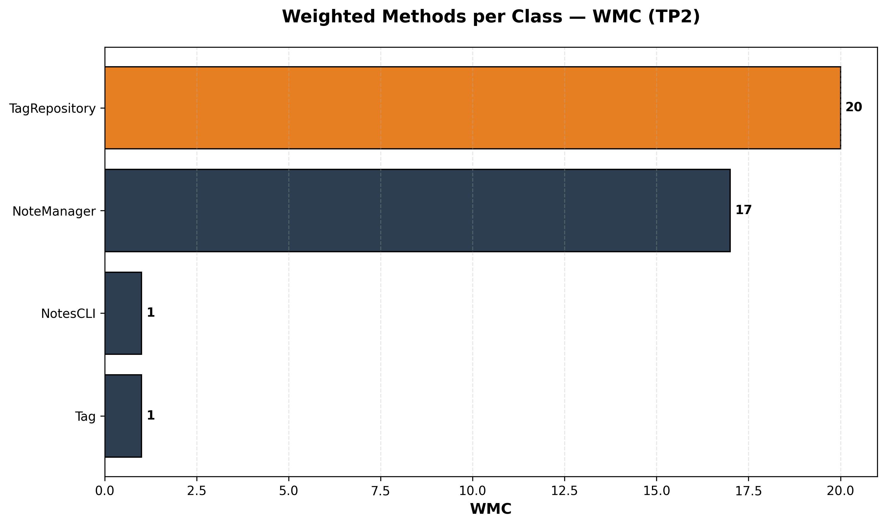
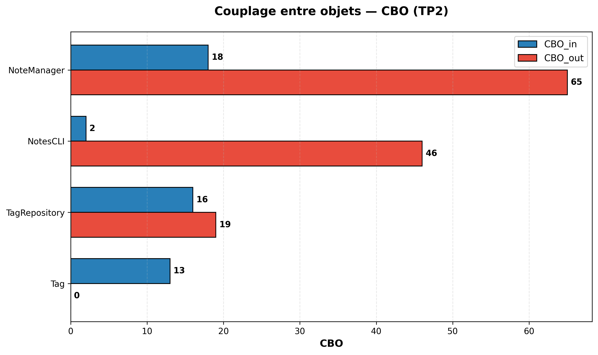
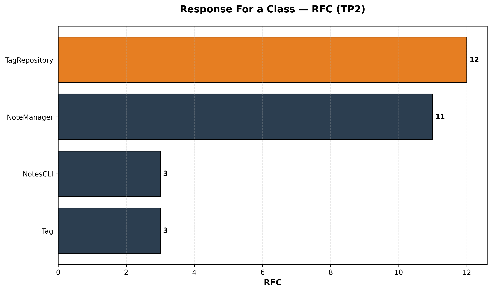
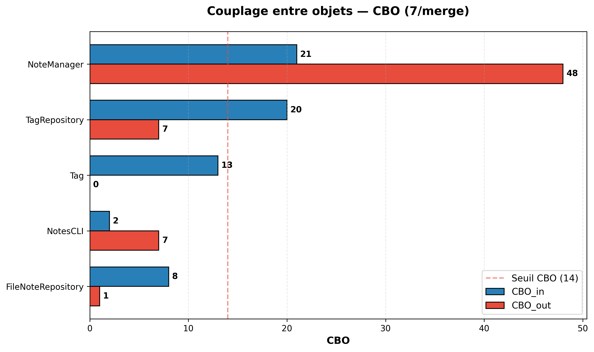
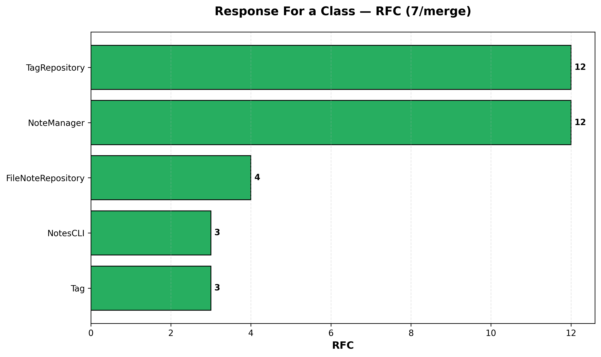
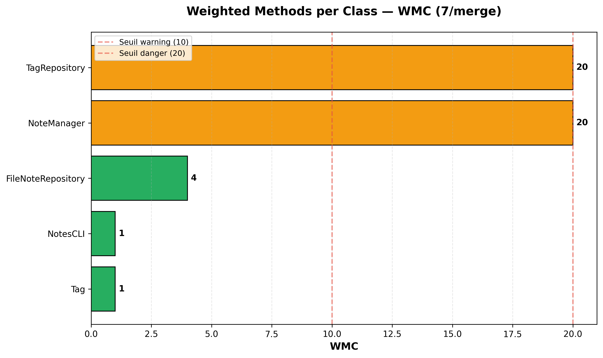
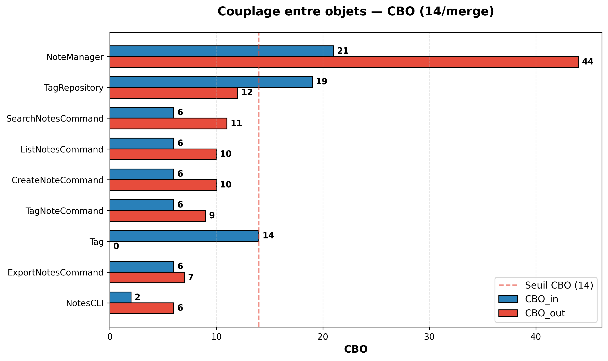
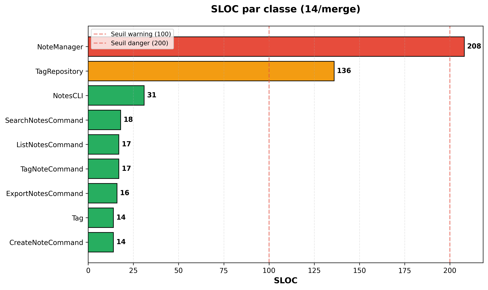

# MGL843-tp3

## Réusinage

L'objectif de ce TP est d'effectuer un réusinage complet du projet en prenant pour point de départ la version issue du TP2.

Voici un bref aperçu des métriques du TP2:

### Contributions de Dorian
Optimisation de la CI/CD :
- Un point notable de mon intervention concerne la mise à jour de la pipeline d'intégration continue (CI). J'ai intégré la génération automatique des métriques via tsfamix, ainsi que la création de schémas d'architecture pour chaque Pull Request (PR). Cette automatisation permet d'obtenir un feedback en temps réel sur l'impact des modifications apportées.

- Gestion des ressources : Une branche dédiée est créée pour l'hébergement des images utilisées dans les commentaires des PRs ; ces ressources sont systématiquement supprimées après la fusion (merge) de la PR pour maintenir le dépôt propre.

#### Refactorisation manuelle

Lien vers la Pull Request : Vous pouvez consulter l'intégralité du travail de restructuration ici : PR [#7](https://github.com/raphaelNguimbus/MGL843-tp1/pull/7)

L'analyse des métriques du TP2 a mis en évidence un "God File" : le fichier server.ts. Ce dernier centralisait de manière excessive la logique métier, la définition des routes et les middlewares.

Actions entreprises :
- Conformément au principe de responsabilité unique (SRP - Single Responsibility Principle), nous avons entrepris un réusinage visant à découpler ces responsabilités dans des fichiers distincts.

##### Ajout de contrôleurs et routes
Ajout de contrôleurs note et tag pour encapsuler la logique HTTP.
Création des routes dédiées pour les notes et les tags, branchées sur Express.
Clarification des responsabilités entre couche web (routes), contrôleurs et logique métier.

##### Refactorisation de la gestion des notes
Scission de l’ancienne classe NoteManager en deux couches distinctes :
Un NoteManager (dossier manager) centré sur la logique métier : CRUD, recherche, gestion d’expiration, gestion des tags associés.
Un FileNoteRepository (dossier repository) responsable uniquement de la persistance des notes au format JSON.
Introduction de l’interface NoteRepository pour découpler la logique métier du support de stockage.
Adaptation des imports dans la CLI, les contrôleurs et les routes pour utiliser cette nouvelle structure.

##### Motivation
Mieux respecter le principe de Responsabilité Unique (SRP).
Réduire le couplage entre logique métier et persistance, faciliter les tests et l’évolutivité (changement de stockage, ajout d’autres implémentations de repository).
Rendre la structure du projet plus claire avec des dossiers manager et repository dédiés.

Voici un aperçut des métriques:

#### Refactorisation LLM (Agent)

Pour la suite du projet, j'ai sollicité l'agent Codex pour identifier des pistes d'amélioration. J'ai utilisé la même branche pour soumettre la Pull Request suivante : PR [#8](https://github.com/raphaelNguimbus/MGL843-tp1/pull/8).

Analyse des modifications apportées :
- Encapsulation réussie : L'agent a encapsulé la classe Repository au sein d'une classe Service. Cette modification est pertinente car elle réduit le couplage entre la logique métier et la couche de persistance.

- Limites de l'intervention : Bien que le couplage ait été amélioré, l'agent n'a pas procédé à la décomposition des différentes responsabilités de la classe NoteManager.

- Constat : En l'absence d'une véritable séparation des préoccupations, la classe NoteManager conserve son statut de "God Class" (ou fichier monolithique), centralisant encore trop de fonctions disparates.

Voici un aperçut des métriques:

### Contributions de Raphaël

#### Refactorisation de NotesCLI

Cette Pull Request refactorise l'interface en ligne de commande (`NotesCLI`) pour corriger l'explosion de ses métriques RFC (Response For a Class) et CBO_out (Couplage sortant).

Avant cette modification, `NotesCLI` agissait comme un composant monolithique gérant toute la configuration et l'implémentation logique du chaînage des commandes commander.

**🛠️ Changements effectués**
- **Création de l'interface `ICLICommand`** : Standardisation du contrat d'exécution pour chaque déclaration de commande.
- **Extraction des commandes** : L'énorme bloc `.action()` de 80 lignes a été divisé en 5 classes indépendantes, cohésives, et dédiées chacune à une responsabilité unique :
  - `CreateNoteCommand`
  - `ListNotesCommand`
  - `TagNoteCommand`
  - `SearchNotesCommand`
  - `ExportNotesCommand`
- **Nettoyage de `NotesCLI`** : Le coordinateur a été réduit à un simple registre de tableau qui itère pacifiquement sans avoir connaissance de la logique interne des commandes.

Voici un aperçu des métriques suite à cette refactorisation :

